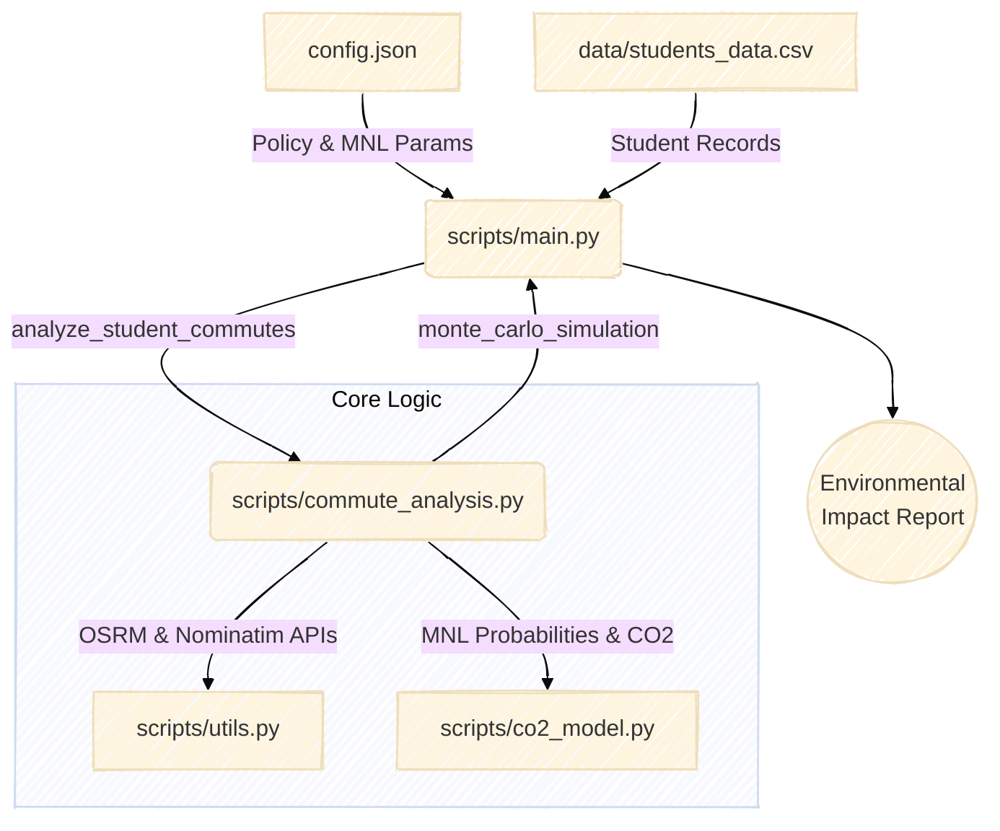

# Student-Routing-Footprint

Estimating the environmental footprint of unnecessary trips to university made by students with minimal exam grades, based on postal codes. Optimal routes and transportation modes are calculated for each student, under the assumption that they would rationally follow them, in order to determine an accurate footprint estimate.

## Features & Modeling Considerations

This project takes several real-world nuances into account to provide a robust estimation:

1. **Industry-Standard MNL Choice Model:** Instead of basic distance heuristics, the model assigns probabilities to *walking/cycling*, *public transport*, and *car usage* using a Multinomial Logit (MNL) utility model. This relies on realistic travel times—including the actual driving duration returned by the OSRM routing engine—to evaluate the real-world "cost" of each transport mode.
2. **Flexible Trip Definitions:** What defines an "unnecessary" trip? By default, the analysis looks at students scoring 0 or 1, but the threshold (`max_unnecessary_grade`) is fully configurable so you can explore various policy scenarios (e.g., any failing grade).
3. **Marginal vs. Average Emissions:** Public transit presents a unique modeling challenge: a bus runs its route regardless of an individual student. The code allows you to toggle between using *average passenger emissions* (standard reporting) and *marginal emissions* (0 added emissions for public transport).
4. **Data Privacy First:** Examining grades alongside geographic data requires care. A built-in anonymization utility can mask postal codes (e.g., "12243" to "122**"), allowing aggregated analysis without compromising student privacy.

## Project Structure & Configuration

This project is designed to be fully configurable and securely handle sensitive data:

- **`config.json`**: The central configuration file. Here you can easily tweak policy rules (e.g., `max_unnecessary_grade`), choose between marginal or average emissions, configure the Monte Carlo simulation runs, and calibrate the mathematical constants (ASC / Beta) of the MNL choice model.
- **`data/` Directory**: Student data is loaded dynamically via a CSV file (e.g., `data/students_data.csv`). For maximum data security, the repository's `.gitignore` is set up to ignore all files inside the `data/` folder (with the exception of the dummy test dataset). This guarantees that real, sensitive university datasets are never accidentally uploaded to version control.

## Getting Started

1. Check `config.json` to configure your policy threshold and simulation parameters.
2. Place your student records into the `data/` folder (a dummy `students_data.csv` is provided as an example) and ensure `config.json` points to it.
3. Run `python scripts/main.py` for a clean, production-ready demonstration that outputs a list of unnecessary trips alongside a statistically robust Monte Carlo footprint report.
