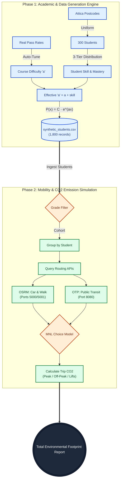

# OSRM & Transit Mobility CO2 Engine

> An end-to-end Agent-Based Monte Carlo simulation that models how university course difficulty translates into real-world student commutes and environmental CO2 footprints.

## Overview

This project provides a comprehensive system for modeling student mobility, predicting transportation mode choices, and calculating the environmental CO2 footprint for university commutes in Attica, Greece (including UNIWA, EKPA, EMP, etc.). 

The system operates in two major phases:
1. **Data Generation**: It creates a synthetic student population, assigns academic skills, and uses a calibrated mathematical model to simulate exam grades based on real-world pass/fail rates.
2. **Mobility Simulation**: It models student commute journeys across the full academic spectrum (grades 0.0 to 10.0), calculating both the mandatory baseline exam footprint and the surplus re-examination footprint caused by failed courses. Routes are generated using local Dockerized OSRM (Open Source Routing Machine) and OTP (OpenTripPlanner) instances, determining transport modes via a Multinomial Logit (MNL) model.

## Features

- **Mathematical Grade Modeling**: Simulates exam outcomes using an exponential probability curve ($P(x) = C \cdot e^{ax}$) tuned to empirical course difficulty with stochastic grading rules.
- **Synthetic Population Generation**: Creates realistic student profiles with a 3-tier behavioral distribution and uniform geographic distribution across Attica.
- **Multinomial Logit Choice Model**: Mathematically predicts mode selection based on travel time, wait time, access constraints, and alternative-specific constants.
- **Interactive Web Dashboard**: Visualizes optimal routes, transport mode probabilities, and CO2 emissions between any Attica postal code and major university campuses using Leaflet.js.
- **Local Routing Engine**: Uses local Dockerized OSRM and OTP instances for fast, real-world, and private public transit and driving route calculations.

## Architecture

The system consists of a data pipeline and a routing simulation sharing the same underlying logic. 



1. **Grade & Student Engine (Python)**: `src/generate_students.py` and `src/grade_model.py` handle the creation of the synthetic dataset (`data/synthetic_students.csv`) by combining empirical course difficulty with student performance categories.
2. **Backend Simulation (Python)**: `src/simulate_failing_students_co2.py` reads the synthetic dataset, groups exams by student, queries the routing APIs, applies the MNL model, and outputs a detailed CLI report of the aggregated CO2 emissions.
3. **Frontend (Web App)**: `frontend/index.html` provides a UI to visualize routes, MNL probabilities, and CO2 for individual journeys.

Both interfaces rely on three Dockerized backend instances:
- **Port 5000 (OSRM)**: Driving profile (for cars, motorcycles, buses).
- **Port 5001 (OSRM)**: Walking profile (for pedestrians).
- **Port 8080 (OTP)**: OpenTripPlanner (for real transit schedules and geometry).

## Core Logic: Grading Engine
 
The system generates grades using a calibrated exponential distribution tuned via `src/tune_coefficients.py` to match exact empirical pass rates.

### Student Performance & Severity Matrix
The simulation categorizes examination outcomes dynamically across course difficulty tiers based on empirical grade distributions:

| Course Difficulty | Low-Performing (Severe Failure / Disengagement) | Moderate-Performing (Marginal / Effort) | High-Performing (Proficiency / High Pass) |
|---|:---:|:---:|:---:|
| **Hard** | 0.0 – 1.0 | 1.1 – 3.9 | 4.0 – 10.0 |
| **Medium** | 0.0 – 2.0 | 2.1 – 5.5 | 5.6 – 10.0 |
| **Easy** | 0.0 – 4.9 | 5.0 – 7.0 | 7.1 – 10.0 |

### Student Archetypes and Examination Dynamics
The synthetic cohort models three distinct student behavioral tiers across the academic curriculum.

| Student Category | Population Share | Skill Offset | Mastery Commitment Probability | Retake Learning Rate |
|---|:---:|:---:|:---:|:---:|
| Bad Students | 25% | -0.08 | 2% to 5% | +0.03 |
| Average Students | 50% | 0.00 | 15% to 30% | +0.06 |
| Good Students | 25% | +0.08 | 55% to 70% | +0.14 |

### Stochastic Grading Rules
The evaluation engine applies three distinct grading transformations with randomized evaluator generosity.
1. Integer Snapping rounds failing marks under 4.0 based on course difficulty.
2. Pity Pass transfers borderline marks at 4.0 and 4.5 to 5.0 using stochastic strictness profiles.
3. Universal Ceiling sets the upper boundary at 10.0 and aggregates theoretical bonus marks.

### Exam Probability Distribution
$$Effective\ a = \text{Course Difficulty} (a) + \text{Student Skill}$$
$$P(\text{grade}) = C \cdot e^{Effective\ a \cdot \text{grade}}$$

## Core Logic: Mode Choice Model

The system uses a Multinomial Logit Model to determine the probability $P(i)$ of choosing a transport mode $i$.

### Generalized Cost ($C_i$)
$$C_i = t_{\text{travel}} + 1.2 \cdot t_{\text{wait}} + \text{Penalty}_{\text{transfer}} + \text{ASC}$$

### Probability of Selection
$$P(i) = \frac{e^{-\theta \cdot C_i}}{\sum_k e^{-\theta \cdot C_k}}$$

### Emission Factors (g CO₂eq / passenger-minute)
- 🚗 **Car**: 60.0
- 🏍️ **Motorcycle**: 40.8
- 🚌 **Bus**: 3.60
- 🚇 **Metro**: 1.74
- 🚶 **Walking**: 0.00

### Urban Routing Speeds and Stochastic Variance
Travel durations incorporate congested peak hour conditions alongside a positive stochastic variance to model artery access and signal coordination.

| Transport Mode | Baseline Speed | Stochastic Variance | Effective Speed Range |
|---|:---:|:---:|:---:|
| 🚗 Car | 15.0 km/h | + Uniform(0.0, 3.5) km/h | 15.0 to 18.5 km/h |
| 🏍️ Motorcycle | 18.0 km/h | + Uniform(0.0, 3.0) km/h | 18.0 to 21.0 km/h |
| 🚌 Bus | 13.5 km/h | + Uniform(0.0, 2.5) km/h | 13.5 to 16.0 km/h |
| 🚇 Metro | 35.0 km/h | Constant | 35.0 km/h |
| 🚶 Walking | 4.2 km/h | + Uniform(0.0, 0.4) km/h | 4.2 to 4.6 km/h |

## Simulation Pipeline

The full end-to-end execution follows this step-by-step stochastic workflow:

1. **Data Generation**: `generate_students.py` seeds 300 students uniformly across Attica postal codes, assigns their skill, and simulates 6 exams per student (1,800 total exams).
2. **Cohort Ingestion & Categorization**: `simulate_failing_students_co2.py` processes student records across the complete grade spectrum (0.0 to 10.0), classifies exam outcomes into the 3×3 severity framework, and isolates the initial mandatory exam takes from repeated retakes.
3. **Route Generation**: 
   - Queries local OSRM engines for Car and Walking routes.
   - Queries OpenTripPlanner for actual Transit itineraries.
   - *Fallback*: Uses Haversine distance approximations if Docker engines are offline. (**Data Integrity Guard**: Automated logging to `experiments_log.csv` is safely aborted if this fallback is triggered, preventing inaccurate spatial data from polluting research statistics.)
4. **Cost Calculation**: Computes the generalized cost for all available modes.
5. **Outbound Leg (Peak Hours)**: Uses the Multinomial Logit Model to select the mode.
6. **Inbound Leg (Off-Peak)**: Incorporates "convenience bias" (80% chance to stick with outbound transit) and calculates return lift probabilities.
7. **Footprint Partitioning & Aggregation**: Disaggregates the environmental footprint into **Baseline (Mandatory 1st Take) CO₂** and **Surplus (Retake) CO₂**, outputting an empirical assessment of the environmental cost of academic failure.

## Tech Stack

| Layer | Technologies |
|---|---|
| Routing Engine | OSRM, OpenTripPlanner (OTP), Docker |
| Frontend | HTML, Vanilla CSS, JavaScript, Leaflet.js |
| Simulation & Math | Python 3, `requests`, `math`, `concurrent.futures` |
| APIs | GraphQL (OTP), REST (OSRM) |
| Data Storage | JSON, CSV |

## Data & Configuration

- **`data/postcodes_attica.json`**: Local geocoding fallback mapping 272 Attica postal codes to coordinates.
- **`data/synthetic_students.csv`**: Generated dataset of 1,800 exam outcomes including `STUDENT_ID`, `TK_KATOIKIA`, `COURSE`, `GRADE`, and `SKILL`.
- **`data/experiments_log.csv`**: Persistent audit log storing statistical snapshots (Total CO2, CI95, mode splits, retake attempts, and demographic sample shares for `Bad_Students_Sample_pct`, `Average_Students_Sample_pct`, `Good_Students_Sample_pct`) for every simulation batch. *(Strictly protected by the Fallback Guard: logging is blocked if OSRM/OTP dockers are down).*
- **`config/config.json`**: Configuration for the MNL model and simulation parameters.

## Requirements

- Python 3.8+
- Docker & Docker Desktop (for local OSRM/OTP routing)
- Git

## Getting Started

### 1. Clone the repository

```bash
git clone https://github.com/angelosdav/Student-Routing-Footprint
cd Student-Routing-Footprint
```

### 2. Start the Docker Containers (Routing APIs)

Start the vehicle routing engine (Port 5000):
```bash
docker run -d --name osrm_transit -p 5000:5000 -v "${PWD}/osrm_data/car:/data" osrm/osrm-backend osrm-routed --algorithm mld /data/attica.osrm
```

Start the pedestrian routing engine (Port 5001):
```bash
docker run -d --name osrm_foot -p 5001:5000 -v "${PWD}/osrm_data/foot:/data" osrm/osrm-backend osrm-routed --algorithm mld /data/attica.osrm
```

Start the OpenTripPlanner (Port 8080):
```bash
docker run -d -p 8080:8080 --name otp -v "${PWD}/osrm_data/otp-data:/var/opentripplanner" docker.io/opentripplanner/opentripplanner:latest --load --serve
```
*(Note: On Windows PowerShell use `${PWD}`. On macOS/Linux use `$(pwd)`)*

### 3. Install Dependencies

```bash
python -m venv .venv
# Windows:
.venv\Scripts\activate
# macOS/Linux:
# source .venv/bin/activate
pip install -r requirements.txt
```

## Usage

### 1. Generate the Synthetic Dataset
Before running the CO2 simulation, you must generate the student population and their grades:
```bash
python src/generate_students.py
```
*(Optional: Run `python src/tune_coefficients.py` to see the mathematical auto-tuning algorithm in action)*

### 2. Run the Environmental Footprint Simulation
Process the synthetic dataset to calculate the CO2 produced by failing students:
```bash
python src/simulate_failing_students_co2.py
```
This outputs a detailed CLI report of every student's trips and the total aggregated CO2.

### 3. Web Dashboard
Open `frontend/index.html` in your web browser to visually explore optimal routes, modal split probabilities, and emissions between any specific postal code and the campus.

## CLI Reference Guide

The Monte Carlo simulation script (`src/simulate_failing_students_co2.py`) provides full command-line configurability to evaluate diverse experimental parameters and intervention policies.

### Arguments

| Parameter | Flag | Type | Default | Description |
|---|:---:|:---:|:---:|---|
| `--runs` | `-n` | `int` | `1000` | Number of Monte Carlo simulation iterations to execute in memory. |
| `--scenario` | `-s` | `str` | `"Baseline"` | Label identifier assigned to the experiment in the persistent logging database. |
| `--campus` | `-c` | `str` | `"UNIWA Egaleo"` | Destination university campus coordinates for multimodal commute routing. |
| `--learning-rate` | | `float` | `0.05` | Linear increment added to the student's difficulty coefficient ($a$) per consecutive retake attempt. |
| `--max-retakes` | | `int` | `6` | Upper limit on allowed exam retake attempts per course before terminating the retake loop (infinite loop safeguard). |
| `--min-grade` | | `float` | `0.0` | Lower bound for initial exam grades included in the cohort filter. |
| `--max-grade` | | `float` | `10.0` | Upper bound for initial exam grades included in the cohort filter (default: `10.0` processes the complete student body). |

### Parameter Details

- **`--runs` (`-n`)**: Controls the statistical sample size of the Monte Carlo engine. Higher values increase estimation precision and narrow the 95% Confidence Interval for mean emissions and modal splits.
- **`--scenario` (`-s`)**: Sets the experiment label written to `data/experiments_log.csv`. Allows multiple distinct policy evaluations to be stored sequentially without overwriting previous runs.
- **`--campus` (`-c`)**: Selects the target destination campus from 22 supported Greek university campuses (e.g., `UNIWA Egaleo`, `EKPA Zografou`, `EMP Zografou`, `OPA Center`, `PAPEI Center`). Dynamically routes student journeys to the selected coordinates.
- **`--learning-rate`**: Governs the rate of academic progression during retakes ($Effective\ a_{\text{attempt}} = a_{\text{base}} + skill + PrepBoost + (attempt - 1) \cdot LearningRate + \Delta_{\text{behavior}}$). Higher values model targeted academic interventions, tutoring programs, or enhanced study materials.
- **`--max-retakes`**: Enforces an administrative cap on examination attempts. Used to model academic progression policies and prevent divergent execution loops.
- **`--min-grade` / `--max-grade`**: Defines the grade range of student records evaluated. Defaults to `[0.0, 10.0]` to ingest the full student population and accurately contrast baseline examination travel with surplus re-examination burdens. Filtering (e.g., `[0.0, 2.0]`) can be applied to isolate specific academic subgroups.
